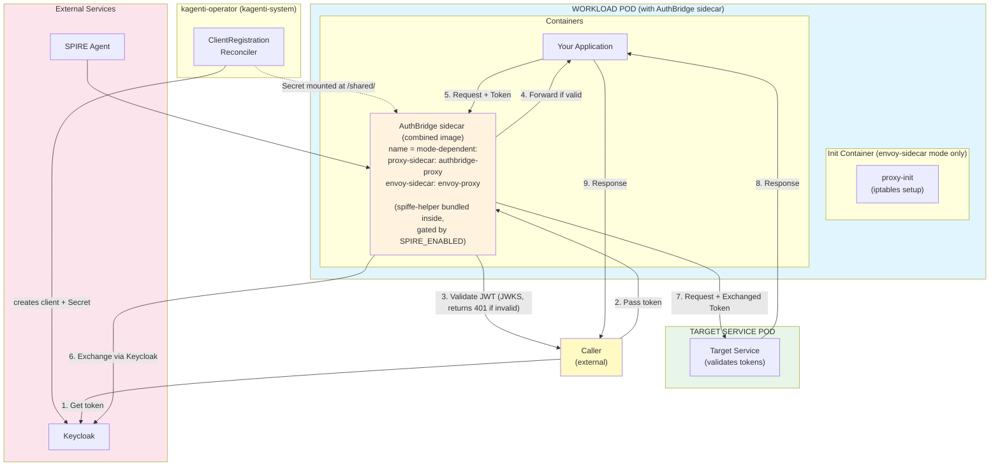
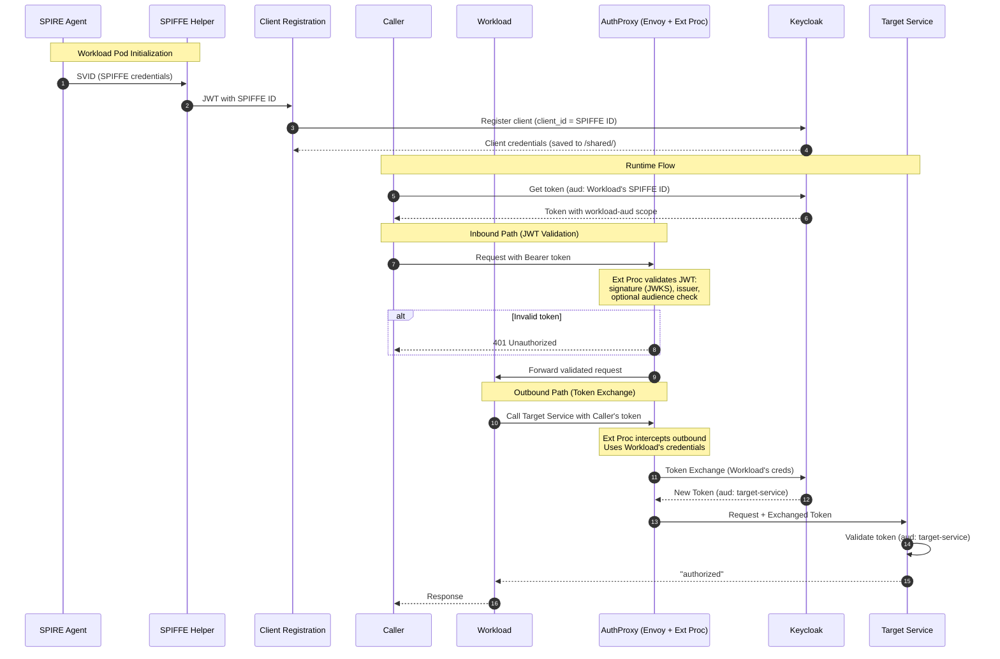

# AuthBridge

AuthBridge provides **secure, transparent token management** for Kubernetes workloads. The shared library is at [`authlib/`](./authlib/); the mode-specific binaries (proxy-sidecar default, envoy-sidecar, lite) live under [`cmd/`](./cmd/). Keycloak client registration is handled by the [kagenti-operator](https://github.com/kagenti/kagenti-operator)'s `ClientRegistrationReconciler` (no in-pod registration sidecar). Together with [SPIFFE/SPIRE](https://spiffe.io), this enables zero-trust authentication flows.

> **📘 Looking to run the demo?** See the [Weather Agent](./demos/weather-agent/demo-ui.md) or [GitHub Issue Agent](./demos/github-issue/demo.md) demos for step-by-step instructions, and [Token-Exchange Routes](./demos/token-exchange-routes/README.md) for route configuration.

## Deployment Modes

The [`cmd/authbridge/`](./cmd/authbridge/) directory contains a unified binary that supports three deployment modes in a single codebase. Two container images are published:

| Image | Contents |
|-------|----------|
| `authbridge` | proxy-sidecar combined: authbridge-proxy binary + bundled spiffe-helper |
| `authbridge-envoy` | envoy-sidecar combined: Envoy + ext_proc + bundled spiffe-helper |
| `authbridge-lite` | proxy-sidecar shape, auth-only plugins (no parsers) |

| Mode | Image | Use Case | How It Works |
|------|-------|----------|-------------|
| `proxy-sidecar` (default) | `authbridge` | HTTP_PROXY-based forward + reverse proxies | Agent routes outbound traffic through forward proxy; reverse proxy validates inbound JWTs |
| `envoy-sidecar` | `authbridge-envoy` | Transparent interception via iptables | Envoy intercepts all traffic, delegates auth to authbridge via ext_proc gRPC |
| `lite` | `authbridge-lite` | Same shape as proxy-sidecar with auth-only plugins (no parsers) | For size-constrained deployments that don't need protocol-aware session events |

The kagenti-operator resolves the mode per workload from `AgentRuntime.Spec.AuthBridgeMode` → namespace ConfigMap → deprecated `kagenti.io/authbridge-mode` annotation → cluster default (`proxy-sidecar`). See kagenti-operator#361.

The shared auth library at [`authlib/`](./authlib/) contains the building blocks (JWT validation, token exchange, caching, routing) with no protocol dependencies. See [`authlib/README.md`](./authlib/README.md) for package reference.

## Architecture (Operator-Injected)

The following describes the operator-injected sidecar deployment. After kagenti-extensions#411 each mode is served by its own combined image (one container per pod, with `spiffe-helper` bundled inside and gated by `SPIRE_ENABLED`). The legacy `authbridge-unified`, `authbridge-light`, `envoy-with-processor`, and standalone `client-registration` / `spiffe-helper` sidecars are gone.

### What AuthBridge Does

AuthBridge solves the challenge of **secure service-to-service authentication** in Kubernetes:

1. **Automatic Identity** - Workloads automatically obtain their identity from SPIFFE/SPIRE and register as Keycloak clients using their SPIFFE ID (e.g., `spiffe://example.com/ns/default/sa/myapp`)

2. **Token-Based Authorization** - Callers obtain JWT tokens from Keycloak with the workload's identity as the audience, authorizing them to invoke specific services

3. **Transparent Token Exchange** - A sidecar intercepts outgoing requests, validates incoming tokens, and exchanges them for tokens with the appropriate target audience—all without application code changes

4. **Target Service Validation** - Target services validate the exchanged token, ensuring it has the correct audience before authorizing requests

## Architecture

```
                  Incoming request (with JWT)
                        │
                        ▼
┌───────────────────────────────────────────────────────────────────────┐
│                         WORKLOAD POD                                  │
│                   (with AuthBridge sidecars)                          │
│                                                                       │
│  ┌─────────────────────────────────────────────────────────────────┐  │
│  │  Init Container: proxy-init (iptables intercepts pod traffic,   │  │
│  │  excluding Keycloak port)                                       │  │
│  └─────────────────────────────────────────────────────────────────┘  │
│                        │                                              │
│                        ▼                                              │
│  ┌─────────────────────────────────────────────────────────────────┐  │
│  │  AuthBridge Sidecar (combined image)                            │  │
│  │  Container name = mode-dependent:                               │  │
│  │    proxy-sidecar (default): authbridge-proxy                    │  │
│  │    envoy-sidecar:           envoy-proxy                         │  │
│  │                                                                 │  │
│  │  INBOUND:  Validates JWT (signature + issuer via JWKS)          │  │
│  │            Returns 401 Unauthorized if invalid                  │  │
│  │  OUTBOUND: Exchanges token → target-service audience            │  │
│  │            (using Workload's credentials)                       │  │
│  └──────────────────────┬──────────────────────────────────────────┘  │
│            ▲ outbound   │ inbound                                     │
│            │ request    │ (validated)                                 │
│            │            ▼                                             │
│  ┌─────────┴───────────────────────────────────────────────────────┐  │
│  │  Your App                                                       │  │
│  │  (spiffe-helper bundled inside the AuthBridge sidecar above,    │  │
│  │   gated per-workload by SPIRE_ENABLED)                          │  │
│  └─────────────────────────────────────────────────────────────────┘  │
└───────────────────────────────────────────────────────────────────────┘
   ▲
   │ Out-of-band: kagenti-operator's ClientRegistrationReconciler
   │ creates the Keycloak client + a kagenti-keycloak-client-credentials
   │ Secret. The webhook mounts that Secret into the AuthBridge sidecar
   │ at /shared/client-{id,secret}.txt — no in-pod registration sidecar.
                        │
                        │ Exchanged token (aud: target-service)
                        ▼
              ┌─────────────────────┐
              │  TARGET SERVICE POD │
              │                     │
              │  Validates token    │
              │  with audience      │
              │  "target-service"   │
              └─────────────────────┘
```

<details>
<summary><b>📊 Mermaid Architecture Diagram (click to expand)</b></summary>



</details>

## Components

### Workload Pod

After kagenti-extensions#411 a workload pod has the application
container plus a single combined AuthBridge sidecar. In
envoy-sidecar mode it also has a one-shot `proxy-init` init
container; in proxy-sidecar mode (the cluster default) it does
not. `spiffe-helper` is bundled inside the sidecar image; client
registration runs in the operator, not the pod.

| Component | Type | Mode | Purpose |
|-----------|------|------|---------|
| `proxy-init` | init | envoy-sidecar only | Sets up iptables to intercept inbound and outbound traffic (excludes Keycloak port to avoid token-exchange loops) |
| `Your App` | container | both | Your application |
| `authbridge-proxy` | container | proxy-sidecar (default) | Combined sidecar from the `authbridge` image: HTTP forward + reverse proxies, full plugin set (jwt-validation + token-exchange + a2a/mcp/inference parsers), bundled spiffe-helper gated by `SPIRE_ENABLED`. |
| `envoy-proxy` | container | envoy-sidecar | Combined sidecar from the `authbridge-envoy` image: Envoy + ext_proc + bundled spiffe-helper. Validates inbound JWTs (signature + issuer via JWKS) and exchanges outbound tokens; HTTPS is TLS-passthrough. |

### Target Service Pod

Any downstream service that validates incoming tokens have the expected audience.

## End-to-End Flow

**Initialization (Workload Pod Startup):**
```
  SPIRE Agent             Workload Pod                        Keycloak
       │                        │                                │
       │  0. SVID               │                                │
       │───────────────────────►│  SPIFFE Helper                 │
       │  (SPIFFE ID)           │                                │
       │                        │                                │
       │                        │  1. Register client            │
       │                        │  (client_id = SPIFFE ID)       │
       │                        │───────────────────────────────►│
       │                        │  Client Registration           │
       │                        │                                │
       │                        │◄───────────────────────────────│
       │                        │  client_secret                 │
       │                        │  (saved to /shared/)           │
```

**Runtime Flow:**
```
  Caller             Workload Pod              Keycloak      Target Service
    │                     │                        │               │
    │  2. Get token       │                        │               │
    │  (aud: Workload's SPIFFE ID)                 │               │
    │─────────────────────────────────────────────►│               │
    │◄─────────────────────────────────────────────│               │
    │  Token (aud: Workload)                       │               │
    │                     │                        │               │
    │  3. Pass token      │                        │               │
    │  to Workload        │                        │               │
    │────────────────────►│                        │               │
    │                     │──────────┐             │               │
    │                     │  Envoy intercepts      │               │
    │                     │  inbound request       │               │
    │                     │          │             │               │
    │                     │  Ext Proc validates    │               │
    │                     │  JWT (signature +      │               │
    │                     │  issuer via JWKS)      │               │
    │                     │          │             │               │
    │                     │  401 if invalid ──────►│ (rejected)    │
    │                     │          │             │               │
    │                     │  4. Forward to App     │               │
    │                     │  if valid              │               │
    │                     │◄─────────┘             │               │
    │                     │                        │               │
    │                     │  5. Workload calls     │               │
    │                     │  Target Service with   │               │
    │                     │  Caller's token        │               │
    │                     │──────────┐             │               │
    │                     │          │             │               │
    │                     │  Envoy intercepts      │               │
    │                     │  outbound request      │               │
    │                     │          │             │               │
    │                     │  6. Token Exchange     │               │
    │                     │  (using Workload creds)│               │
    │                     │───────────────────────►│               │
    │                     │◄───────────────────────│               │
    │                     │  New token (aud: target-service)       │
    │                     │          │             │               │
    │                     │  7. Forward request    │               │
    │                     │  with exchanged token  │               │
    │                     │───────────────────────────────────────►│
    │                     │                        │               │
    │                     │◄───────────────────────────────────────│
    │                     │  "authorized"          │               │
    │◄────────────────────│                        │               │
    │  Response           │                        │               │
```

## What Gets Verified

| Step | Component | Verification |
|------|-----------|--------------|
| 0 | SPIFFE Helper | SVID obtained from SPIRE Agent |
| 1 | Client Registration | Workload registered with Keycloak (client_id = SPIFFE ID) |
| 2 | Caller | Token obtained with `aud: Workload's SPIFFE ID` |
| 3 | Envoy + Ext Proc (inbound) | Inbound JWT validated: signature verified via JWKS, issuer checked, optional audience check. Returns 401 if invalid. |
| 4 | Workload | Validated request forwarded to application |
| 5 | Envoy + Ext Proc (outbound) | Outbound request intercepted; token exchanged using Workload's credentials → `aud: target-service` |
| 6 | Target Service | Token validated (`aud: target-service`), returns `"authorized"` |

## Detailed End-to-End Flow

<details>
<summary><b>📊 Mermaid Diagram (click to expand)</b></summary>



### Detailed Flow Summary

| Step | From → To | Action |
|------|-----------|--------|
| **Initialization Phase** |||
| 1 | SPIRE → SPIFFE Helper | Issue SVID (SPIFFE credentials) |
| 2 | SPIFFE Helper → Client Registration | Pass JWT with SPIFFE ID |
| 3 | Client Registration → Keycloak | Register client (`client_id` = SPIFFE ID) |
| 4 | Keycloak → Client Registration | Return client credentials (saved to `/shared/`) |
| **Runtime Phase — Inbound (JWT Validation)** |||
| 5 | Caller → Keycloak | Request token (`aud`: Workload's SPIFFE ID) |
| 6 | Keycloak → Caller | Return token with workload-aud scope |
| 7 | Caller → Envoy (inbound) | Request intercepted by iptables, routed to Envoy inbound listener |
| 8 | Envoy → Ext Proc | Validate JWT: signature (JWKS), issuer, optional audience. Returns 401 if invalid. |
| 9 | Envoy → Workload | Forward validated request to application |
| **Runtime Phase — Outbound (Token Exchange)** |||
| 10 | Workload → Envoy (outbound) | Outbound request intercepted by iptables, routed to Envoy outbound listener |
| 11 | Envoy → Ext Proc → Keycloak | Token Exchange (using Workload's credentials) |
| 12 | Keycloak → Envoy | Return new token (`aud`: target-service) |
| 13 | Envoy → Target Service | Forward request with exchanged token |
| 14 | Target Service | Validate token (`aud`: target-service) |
| 15 | Target Service → Workload | Return "authorized" |
| 16 | Workload → Caller | Return response |

</details>

## Key Security Properties

- **No Static Secrets** - Credentials are dynamically generated during registration
- **Short-Lived Tokens** - JWT tokens expire and must be refreshed
- **Inbound JWT Validation** - Incoming requests are validated at the sidecar (signature via JWKS, issuer, optional audience) before reaching the application
- **Self-Audience Scoping** - Tokens include the Workload's own identity as audience, enabling token exchange
- **Same Identity for Exchange** - AuthProxy uses the Workload's credentials (same SPIFFE ID), matching the token's audience
- **Transparent to Application** - Both inbound validation and outbound token exchange are handled by the sidecar; applications don't need to implement either
- **Configurable Targets** - Route-based configuration maps destination hosts to target audiences

## Prerequisites

- Kubernetes cluster (Kind recommended for local development)
- SPIRE installed and running (server + agent) - for SPIFFE version
- Keycloak deployed
- Docker/Podman for building images

### Quick Setup

The easiest way to get all prerequisites is to use the [Kagenti Ansible installer](https://github.com/kagenti/kagenti/blob/main/docs/install.md#ansible-based-installer-recommended).

## Getting Started

### Demos

- **[Weather Agent Demo](./demos/weather-agent/demo-ui.md)** - Recommended starting demo: shows how the [kagenti-operator](https://github.com/kagenti/kagenti-operator) webhook automatically injects the combined AuthBridge sidecar, with inbound JWT validation and outbound passthrough
- **[GitHub Issue Agent Demo](./demos/github-issue/demo.md)** - End-to-end demo with the real GitHub Issue Agent and GitHub MCP Tool, showing transparent token exchange via AuthBridge
  - [Manual deployment](./demos/github-issue/demo-manual.md) — deploy everything via `kubectl` and YAML manifests
  - [UI deployment](./demos/github-issue/demo-ui.md) — import agent and tool via the Kagenti dashboard
- **[Token-Exchange Routes](./demos/token-exchange-routes/README.md)** - Configuration reference for the `authproxy-routes` ConfigMap; covers single-target (one route) and multi-target (one agent → many tools) patterns

All demos cover configuring Keycloak, deploying, and testing.

### Route-Based Configuration

AuthBridge supports per-host token exchange configuration via `routes.yaml`:

```yaml
# Exchange tokens for target-alpha audience when calling this host
- host: "target-alpha-service.authbridge.svc.cluster.local"
  target_audience: "target-alpha"
  token_scopes: "openid target-alpha-aud"

# Glob patterns supported
- host: "*.internal.svc.cluster.local"
  passthrough: true  # Skip token exchange
```

### Keycloak Sync

Use `keycloak_sync.py` to reconcile routes.yaml with Keycloak configuration:

```bash
python keycloak_sync.py --config routes.yaml --agent-client "spiffe://..." --yes
```

This creates target clients, audience scopes, and assigns scopes to the agent.

## Component Documentation

- [authlib](authlib/README.md) — Shared auth building blocks (Go library)
- [cmd/authbridge-proxy](cmd/authbridge-proxy/) — proxy-sidecar binary (default mode, full plugin set)
- [cmd/authbridge-envoy](cmd/authbridge-envoy/) — envoy-sidecar binary (Envoy + ext_proc, full plugin set)
- [cmd/authbridge-lite](cmd/authbridge-lite/) — auth-only proxy-sidecar binary (no parsers)
- [proxy-init](proxy-init/README.md) — iptables init container (envoy-sidecar mode only)
- [docs/](docs/) — framework architecture and plugin author references

Keycloak client registration is handled by the [kagenti-operator](https://github.com/kagenti/kagenti-operator)'s `ClientRegistrationReconciler`, not by an in-pod sidecar.

## References

- [Kagenti Installation](https://github.com/kagenti/kagenti/blob/main/docs/install.md)
- [SPIRE Documentation](https://spiffe.io/docs/latest/)
- [OAuth 2.0 Token Exchange (RFC 8693)](https://www.rfc-editor.org/rfc/rfc8693)
